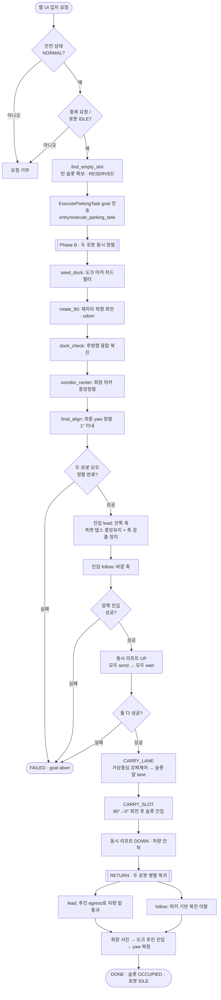
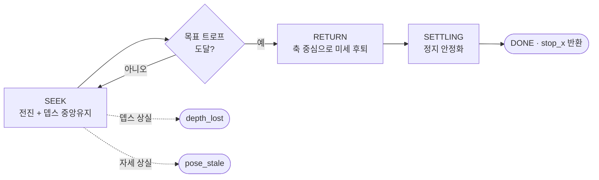
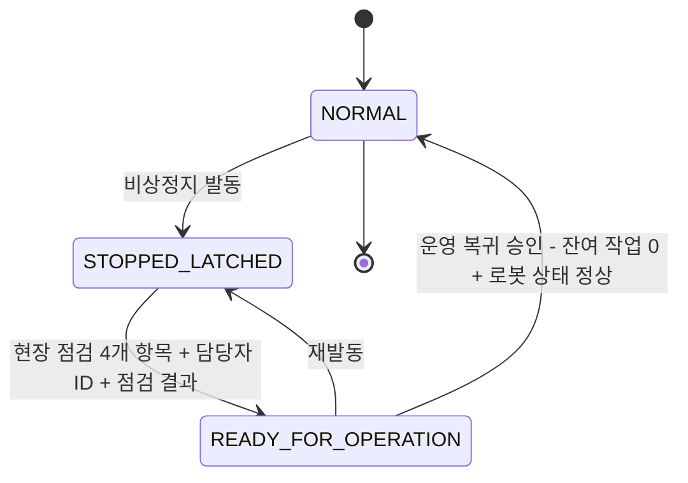

# 🚗 2로봇 협동 자율 발렛파킹 시스템 (ROS2 Humble + Isaac Sim)

이 프로젝트는 **ROS2 Humble**과 **NVIDIA Isaac Sim 5.1** 환경에서 구축된 자율 발렛파킹 로봇 시스템입니다.

메카넘 휠 협동로봇 **2대가 한 팀**이 되어 차량 **밑으로 들어가 들어올린 뒤** 주차면까지 운반합니다.
**ArUco 바닥 마커 + 휠 오도메트리 융합 측위**로 GPS·SLAM 없이 센티미터 단위 정밀 주행을 수행하며,
**입차(ENTRY) 팀**과 **출차(EXIT) 팀**이 각각 독립 PC에서 제어되고 **관제(Control Tower)** 가 웹 UI 요청을 두 팀으로 라우팅합니다.

> 실제 하드웨어로 전환 시 Isaac Sim 자리에 실물 로봇 4대가 들어옵니다 — 나머지 ROS2 구조는 그대로입니다.

---

## 📌 주요 기능 (Key Features)

### 1. 마커 융합 측위 (ArUco Fusion Localization)

- **이중 카메라 융합**: 로봇 전방·후방 카메라가 동시에 바닥 ArUco 마커(`DICT_5X5_100`, 한 변 0.194m)를 검출합니다.
- **예측-보정 필터**: 휠 오도메트리로 자세를 **예측**(`predict_body`)하고, 마커 관측으로 **보정**(`update`)합니다. SLAM 없이 마커가 유일한 절대 기준입니다.
- **런타임 기준 마커 전환**: 오케스트레이터가 주행 단계마다 `set_parameters`로 `ref_ids`를 바꿔, 그 구간에서 봐야 할 마커만 하드필터링합니다.
- **실측 정확도**: 주행 궤적 p95 **1.90cm**(단일 마커 2.52cm 대비 개선), 종단 정렬 **1° 이내**.

### 2. 차량 하부 진입 & 협동 리프트 (Ingress & Cooperative Lift)

- **측면 뎁스캠 중앙유지**: 좌/우 뎁스 카메라의 ROI 최소거리 차이로 횡방향(`vy`)을 실시간 보정하며 차량 밑을 통과합니다.
- **축(axle) 검출 정지**: 뎁스 프로파일의 **트로프(trough)** 를 추적해 앞축/뒷축 중심에 정확히 정지합니다. `lead`는 안쪽 축, `follow`는 바깥 축을 담당합니다.
- **동시 리프트**: 두 로봇의 리프트 goal을 **모두 send한 뒤에야 wait**합니다. 순차 send+wait 방식은 차량이 들리지 않는 실패가 실측 재현되었습니다.
- **이중 워치독**: 자세 유실(`cmd_watchdog_sec`) · 뎁스 신호 상실(`depth_loss_timeout_sec`) 시 즉시 정지합니다.

### 3. 가상중심 강체 운반 (Virtual-Center Rigid-Body Carry)

- **강체 모델링**: 차량을 든 두 로봇을 하나의 강체로 보고, `follow`의 후방 마커 측위를 차량 대표 자세로 삼아 `lead = follow + L·heading`으로 유도합니다.
- **마커 유무 2갈래 제어**: 마커가 안 보이면 **경로 방향 순항만**(`vy=wz=0`), `follow`가 마커로 자기 위치·yaw를 실제로 알 때만 옆·회전 정렬을 냅니다. 오도만 믿고 항상 보정하면 슬립 드리프트를 추종해 발산합니다.
- **회전 선행 게이트**: yaw 오차가 임계값을 넘으면 병진을 죽이고 회전만 수행해, 슬롯 진입 시 입구를 비스듬히 긁는 것을 막습니다.

### 4. 중앙 관제 & 안전 (Control Tower & Safety)

- **요청 라우팅**: 웹 UI 요청을 `request_type`(ENTRY/EXIT)에 따라 입차/출차 전용 로봇쌍으로 분기합니다.
- **Fail-safe 안전 게이트**: `task_dispatcher`는 `safety_supervisor`의 `/safety/state`가 `NORMAL`이 아니면 **모든 신규 요청을 거부**합니다. 하트비트가 3초 두절되면 `UNKNOWN`으로 강등됩니다.
- **3단계 비상정지 복구**: `STOPPED_LATCHED` → (현장 점검 + 관제 확인) → `READY_FOR_OPERATION` → (운영 복귀 승인) → `NORMAL`. 상태는 MySQL에 영속 저장되어 노드 재기동과 무관하게 유지됩니다.
- **천장 LiDAR 감시**: 통로 장애물과 슬롯 점유를 독립 검증하고 RViz2·웹 UI에 동시 발행합니다.

### 5. 전 구간 자동화 (Full Cycle Automation)

도크 스폰 → 회랑 정렬 → 차량 하부 진입 → 리프트 → 운반 → 주차 안착 → **도크 복귀**까지 한 번의 액션 호출로 완주합니다.
복귀는 두 로봇이 **병렬 독립 주행**하며, `lead`는 차량 바퀴 사이에서 회전이 물리적으로 불가능하므로 **후진 egress**로 들어온 경로를 되짚어 나옵니다.

---

## 🛠️ 시스템 설계 (System Architecture)

### 전체 구조

시스템은 크게 **Perception(인식)** · **Decision(판단)** · **Control(제어)** 세 파트로 구성됩니다.

1. **Perception**: 전/후방 RGB 카메라로 ArUco 마커를 검출하고 휠 오도메트리와 융합해 월드 자세를 추정합니다. 측면 뎁스 카메라는 차량 축을, 천장 LiDAR는 장애물·슬롯 점유를 담당합니다.
2. **Decision**: `pickup_orchestrator_node`가 미션 상태머신(Phase B → 진입 → 리프트 → 운반 → 안착 → 복귀)을 총괄하고, 관제의 `task_dispatcher`가 요청 접수·슬롯 배정·안전 게이트를 판정합니다.
3. **Control**: `pose_controller_node`(자세 제어), `ingress_node`(하부 진입), `carry_action_server`(강체 운반)가 메카넘 역기구학을 거쳐 `/cmd_vel`을 발행합니다.

### 계층 구조

```
┌──────────────────────────────────────────────────────────────┐
│  웹 UI (FastAPI, :8000)          UI/ui_ws/parking_control_mvp │
│    └ 입/출차 요청 · 대시보드 · 비상정지 · LiDAR 시각화          │
└────────────────────────────┬─────────────────────────────────┘
                             │ dispatch_parking_task
┌────────────────────────────▼─────────────────────────────────┐
│  관제 (Control Tower)                UI/ui_ws/parking_control │
│   safety_supervisor · task_dispatcher · parking_slot_manager  │
│   robot_position_bridge · safety_monitor        [MySQL]       │
└──────────┬──────────────────────────────────┬────────────────┘
   ENTRY   │                                  │  EXIT
┌──────────▼──────────────┐      ┌────────────▼─────────────────┐
│  입차 스택 (entry_ws)    │      │  출차 스택 (exit_ws)          │
│  pickup_orchestrator     │      │  exit_pickup_orchestrator     │
│  ├ marker_localizer ×2   │      │  ├ marker_localizer ×2        │
│  ├ pose_controller ×4    │      │  ├ pose_controller ×4         │
│  ├ axle_detector ×2      │      │  ├ axle_detector ×2           │
│  ├ ingress ×2            │      │  ├ ingress ×2                 │
│  ├ lift ×2               │      │  ├ lift ×2                    │
│  └ carry_action_server    │      │  └ exit_carry_action_server   │
└──────────┬──────────────┘      └────────────┬─────────────────┘
           │        FastDDS (ROS_DOMAIN_ID=126)│
┌──────────▼───────────────────────────────────▼───────────────┐
│  Isaac Sim 5.1 브리지 (sim_bridge.py, 단 1개)                  │
│  발행: /odom · /joint_states · front·rear/image_raw · l/r depth│
│  구독: /cmd_vel · /lift_cmd                                    │
└──────────────────────────────────────────────────────────────┘
```

### 노드 구성 (입차 스택 기준)

| 레이어 | 노드 | 패키지 | 역할 |
|---|---|---|---|
| 측위 | `/robot_<id>/marker_localizer_node` ×2 | `parkbot_aruco` | 전/후방 카메라 + 휠오도 융합 → `/pose` 발행 |
| 제어 | `pose_controller_odom_<id>` ×2 | `parkbot_motion` | 오도 기반 제자리 회전 (`navigate_to_pose`) |
| 제어 | `pose_controller_fused_<id>` ×2 | `parkbot_motion` | 융합 자세 정밀 주행 (`navigate_to_pose_fused`) |
| 인식 | `axle_detector_<id>` ×2 | `parkbot_motion` | 측면 뎁스 트로프 → 차량 축 중심 검출 |
| 제어 | `ingress_<id>` ×2 | `parkbot_motion` | 차량 하부 진입/이탈 상태머신 |
| 제어 | `lift_<id>` ×2 | `parkbot_motion` | 리프트 UP/DOWN 액션 서버 |
| 제어 | `carry_action_server` | `parkbot_motion` | 가상중심 강체 운반 |
| 총괄 | `pickup_orchestrator_node` | `parkbot_motion` | 미션 상태머신 (`/entry/execute_parking_task`) |

### 주요 ROS2 인터페이스

| 종류 | 이름 | 타입 |
|---|---|---|
| Action | `/entry/execute_parking_task`, `/exit/…` | `ExecuteParkingTask` |
| Action | `/entry/carry_to_slot`, `/exit/…` | `CarryToSlot` |
| Action | `/robot_<id>/navigate_to_pose(_fused)` | `nav2_msgs/NavigateToPose` |
| Action | `/robot_<id>/ingress_under_truck` | `IngressUnderTruck` |
| Action | `/robot_<id>/control_lift` | `ControlLift` |
| Service | `dispatch_parking_task` | `RequestParkingTask` |
| Service | `find_empty_slot` / `acquire_zones` / `release_zones` | `FindEmptySlot` / `AcquireZones` / `ReleaseZones` |
| Service | `/safety/activate_emergency_stop` · `request_reset` · `approve_operation` | `ActivateEmergencyStop` 외 |
| Topic | `/safety/state` (transient-local) | `SafetyState` |
| Topic | `/parking/slot_occupancy`, `/parking/lidar/points_world` | `SlotOccupancyArray`, `PointCloud2` |

### ROS 그래프 격리

입차/출차가 이름공간을 완전히 나눠 한 DDS 도메인(126)에서 공존합니다.

| 축 | 입차 | 출차 |
|---|---|---|
| 로봇 네임스페이스 | `/robot_entry_*` | `/robot_exit_*` |
| 미션 액션 | `/entry/execute_parking_task` | `/exit/execute_parking_task` |
| 노드명 | `pickup_orchestrator_node` | `exit_pickup_orchestrator_node` |

---

## 📊 알고리즘 플로우차트 (Logic Flow)

### 입차(ENTRY) 미션 전체 흐름



### 차량 하부 진입 상태머신 (`ingress_node`)



### 안전 상태 전이 (`safety_supervisor`)



---

## 💻 개발 환경 (Environment)

- **OS**: Ubuntu 22.04 LTS (Jammy Jellyfish)
- **Middleware**: ROS 2 Humble Hawksbill
- **Simulator**: NVIDIA Isaac Sim 5.1 (번들 Python 3.11)
- **Language**: Python 3.10 (ROS2 노드) / Python 3.11 (Isaac 브리지)
- **DDS**: Fast DDS (`rmw_fastrtps_cpp`), `ROS_DOMAIN_ID=126` + 화이트리스트 XML 필수
- **Database**: MySQL 8.0 (관제 PC 전용)
- **Web**: FastAPI + Uvicorn
- **Key Libraries**: `rclpy`, `nav2_msgs`, `cv_bridge`, `opencv-python`(ArUco), `numpy`, `networkx`, `mysql-connector-python`

> ⚠️ Isaac Sim(py3.11)과 시스템 Humble(py3.10)은 **FastDDS 공유메모리(SHM) 전송이 크로스버전 비호환**입니다.
> 화이트리스트로 UDP를 강제하지 않으면 `ros2 topic list`에는 보여도 데이터가 흐르지 않습니다(§ 의존성 설치 1단계).

---

## ⚙️ 사용 장비 (Hardware Setup)

본 프로젝트는 **현대위아형 주차로봇**(메카넘 휠 + 스윙암 리프트) 모델 4대를 기준으로 개발되었습니다.

### 로봇 사양

| 항목 | 사양 |
|---|---|
| 구동 방식 | Mecanum 4WD (홀로노믹) |
| 휠 반지름 | 0.060 m |
| 휠베이스 / 트랙 (반값) | LX = 0.68 m / LY = 0.35 m |
| 리프트 | 4× Swing Arm (Z축 revolute) + Bearing Roller |
| 보조 지지 | 4× Passive Swivel Caster (휠 반지름 0.028 m) |
| 총 링크 / 조인트 | 25 links / 24 joints |

### 로봇 4대 편성

| Robot ID | 팀 | 역할 | 도크 마커 | 스폰 좌표 (x, z, yaw) |
|---|---|---|---|---|
| `entry_lead` | ENTRY | 앞축(front axle) 담당 | D_OUT_1 (id 21) | (-3.2, 2.2, 90°) |
| `entry_follow` | ENTRY | 뒷축(rear axle) 담당 | D_OUT_2 (id 23) | (-1.2, 2.2, 90°) |
| `exit_lead` | EXIT | 앞축 담당 | D_IN_1 (id 20) | (-3.2, -2.2, 90°) |
| `exit_follow` | EXIT | 뒷축 담당 | D_IN_2 (id 22) | (-1.2, -2.2, 90°) |

### 센서 구성

| Component | Type | Topic / Spec |
|---|---|---|
| 전방 카메라 | RGB (ArUco 검출) | `/robot_<id>/front/image_raw` + `/camera_info` (640×480, 20Hz) |
| 후방 카메라 | RGB (ArUco 검출) | `/robot_<id>/rear/image_raw` + `/camera_info` — 전방의 Rz(180°) 미러 |
| 좌측 뎁스캠 | Depth (축 검출) | `/robot_<id>/left/depth` (`32FC1`, m 단위) |
| 우측 뎁스캠 | Depth (축 검출) | `/robot_<id>/right/depth` (`32FC1`, m 단위) |
| 휠 오도메트리 | Odometry | `/robot_<id>/odom` (`nav_msgs/Odometry`) |
| 천장 LiDAR ×1 | PointCloud | `/parking/lidar/points_world` — 설치 위치 (0.5, 0.0, 5.12) |
| 구동 명령 | Twist | `/robot_<id>/cmd_vel` (vx, vy, wz — 홀로노믹) |
| 리프트 명령 | Float32 | `/robot_<id>/lift_cmd` (0.0~1.0 전개 스케일, 1.0/s 램프) |

### 주차장 환경 (v4)

| 항목 | 값 |
|---|---|
| 주차면 | A1 / A2 / A3 (3칸) — x = 2.8 / 6.2 / 9.6 |
| 회랑선 (운반 경로) | z = 7.075 (입차) / z = -7.075 (출차) |
| 좌표 규약 | **입차 = z 양수 / 출차 = z 음수** (Isaac 에셋 라벨과 반대, `site_map_v4.py`가 흡수) |
| nav yaw 규약 | `ψ = atan2(fwd_x, fwd_z)` → 0°=+z(북), 90°=+x(동), ±180°=남 |
| ArUco 마커 | `DICT_5X5_100`, 한 변 0.19444 m, 총 16종 (`marker_map_v4.json`) |

---

## 📦 의존성 설치 (Installation)

### 1. DDS 화이트리스트 (⭐ 필수 — 안 하면 "토픽은 보이는데 데이터가 안 흐름")

`~/.ros/fastdds_whitelist.xml` 로 저장합니다.

```xml
<?xml version="1.0" encoding="UTF-8" ?>
<dds xmlns="http://www.eprosima.com/XMLSchemas/fastRTPS_Profiles">
  <profiles>
    <transport_descriptors>
      <transport_descriptor>
        <transport_id>closed_net_udp</transport_id>
        <type>UDPv4</type>
        <interfaceWhiteList>
          <address>127.0.0.1</address>   <!-- 1대 PC면 이 줄만 있어도 됨 -->
          <address>10.10.0.1</address>   <!-- 멀티 PC면 각 PC의 IP를 -->
          <address>10.10.0.2</address>   <!-- 전부 나열 (관제/입차/출차/Isaac) -->
          <address>10.10.0.3</address>
          <address>10.10.0.4</address>
        </interfaceWhiteList>
      </transport_descriptor>
    </transport_descriptors>
    <participant profile_name="closed_net" is_default_profile="true">
      <rtps>
        <userTransports><transport_id>closed_net_udp</transport_id></userTransports>
        <useBuiltinTransports>false</useBuiltinTransports>
      </rtps>
    </participant>
  </profiles>
</dds>
```

### 2. 공통 환경변수 (⭐ Isaac·노드 **모든** 터미널에서 먼저)

```bash
export ROS_DOMAIN_ID=126
export RMW_IMPLEMENTATION=rmw_fastrtps_cpp
export FASTRTPS_DEFAULT_PROFILES_FILE=~/.ros/fastdds_whitelist.xml
export FASTDDS_DEFAULT_PROFILES_FILE=~/.ros/fastdds_whitelist.xml
```

`~/.bashrc`에 넣어두면 편합니다.

### 3. ROS2 패키지 설치

```bash
sudo apt update
sudo apt install -y \
    ros-humble-navigation2 ros-humble-nav2-msgs \
    ros-humble-cv-bridge ros-humble-vision-msgs \
    ros-humble-tf2-ros ros-humble-visualization-msgs \
    python3-colcon-common-extensions
```

### 4. Python 라이브러리

```bash
pip install opencv-python numpy networkx pyyaml
```

### 5. MySQL 세팅 (관제 PC만)

접속 정보는 코드 기본값(`UI/ui_ws/src/parking_control/parking_control/core/db.py`)과 일치해야 합니다.

```bash
sudo mysql -e "CREATE DATABASE IF NOT EXISTS parking;
  CREATE USER IF NOT EXISTS 'parking'@'localhost' IDENTIFIED BY 'parking1234';
  GRANT ALL PRIVILEGES ON parking.* TO 'parking'@'localhost'; FLUSH PRIVILEGES;"

# 스키마·시드를 순서대로 로드
for f in UI/ui_ws/src/parking_control/db/0*.sql; do
  echo "load $f"; mysql -u parking -pparking1234 parking < "$f"
done
```

### 6. 웹 UI 가상환경 (관제 PC만)

```bash
cd UI/ui_ws/parking_control_mvp
python3 -m venv .venv && source .venv/bin/activate
pip install -r requirements.txt        # fastapi, uvicorn
pip install -r requirements-ros2.txt   # mysql-connector-python
```

### 7. Isaac Sim 경로 확인

`sim_bridge.sh`가 `~/dev_ws/isaac_sim/isaacsim/_build/linux-x86_64/release` 를 기대합니다.
다른 곳에 설치했다면 `sim_bridge.sh`의 `REL=` 한 줄을 수정하세요.

---

## 🚀 실행 순서 (How to Run)

### STEP 0. 빌드 (최초 1회 + 소스 수정 시)

각 워크스페이스를 **독립적으로** 빌드합니다. `--symlink-install`을 반드시 붙이세요 —
복사 설치가 되면 Python 소스 수정이 런타임에 반영되지 않습니다.

```bash
# 관제 PC
cd UI/ui_ws  && colcon build --symlink-install && source install/setup.bash

# 입차 PC
cd entry_ws  && colcon build --symlink-install && source install/setup.bash

# 출차 PC
cd exit_ws   && colcon build --symlink-install && source install/setup.bash
```

> 📁 `build/`, `install/`, `log/` 는 빌드 산출물이므로 `.gitignore`에 등록되어 있어
> 어느 워크스페이스에서 생성되든 **저장소에 커밋되지 않습니다.** 별도 정리가 필요 없습니다.

---

### 통합 실행 (권장 순서)

> 각 터미널은 **① 환경변수(설치 2단계) → ② 자기 워크스페이스만 source** 한 상태여야 합니다.
> ⚠️ 한 터미널에서 워크스페이스를 2개 이상 source 하지 마세요 (§ 자주 겪는 문제 1번).

#### 1️⃣ Isaac Sim 브리지 (가상 세계 + 로봇 4대 스폰)

통합 운영 시 **반드시 1개만** 띄웁니다. 4대가 같은 차량·같은 주차장을 공유해야 충돌회피가 성립합니다.

```bash
# 터미널 1
cd entry_ws
BRIDGE_CAMERAS=all ./isaacpjt/Isaac_envo/sim_bridge.sh
```

| 옵션 | 설명 |
|---|---|
| `BRIDGE_CAMERAS=all` | 4대 카메라 전부 렌더 (통합 데모 필수) |
| `BRIDGE_CAMERAS=entry_lead,entry_follow` | 기본값. 입차만 렌더 → GPU 부하↓, RTF↑ |
| `--gui` | Isaac 뷰포트 창 표시 (기본은 헤드리스) |

#### 2️⃣ 관제 스택 (⭐ 반드시 입·출차보다 **먼저**)

`task_dispatcher`는 fail-safe라 `safety_supervisor`의 `/safety/state`를 못 받으면 모든 요청을 조용히 거부합니다.

```bash
# 터미널 2
cd UI/ui_ws && source install/setup.bash
ros2 launch parking_control control_tower.launch.py
```

기동되는 노드: `safety_supervisor` · `parking_slot_manager` · `task_dispatcher` · `robot_position_bridge` · `safety_monitor`

#### 3️⃣ 입차 로봇 스택

```bash
# 터미널 3
cd entry_ws && source install/setup.bash
ros2 launch parkbot_motion nodes.launch.py
```

#### 4️⃣ 출차 로봇 스택

```bash
# 터미널 4
cd exit_ws && source install/setup.bash
ros2 launch parkbot_motion exit_nodes.launch.py
```

#### 5️⃣ 관제 웹 UI

```bash
# 터미널 5
cd UI/ui_ws/parking_control_mvp && source .venv/bin/activate
PARKING_MODE=ros2 python3 -m uvicorn main:app --host 0.0.0.0 --port 8000
```

| 주소 | 설명 |
|---|---|
| http://127.0.0.1:8000 | 관제 대시보드 (입/출차 요청, 로봇 위치, 슬롯 상태, 비상정지) |
| http://127.0.0.1:8000/docs | API 문서 (Swagger UI) |

`PARKING_MODE` 값: `mock`(인메모리 시뮬) / `ros2`(관제 DB 연동) / `prs` / `dual`(입·출차 그룹 분리 라우팅)

---

### 단독 / 1-PC 테스트

Isaac + 입차 스택만으로도 전체 미션이 검증됩니다. 다른 PC와 섞이지 않게 도메인을 분리하세요.

```bash
export ROS_DOMAIN_ID=130   # 통합 도메인(126)과 격리

# 미션 직접 트리거 (관제·UI 없이)
ros2 action send_goal /entry/execute_parking_task \
  parking_robot_interfaces/action/ExecuteParkingTask "{slot_id: 'A1'}"
```

**복귀(RETURN) 시퀀스만 반복 검증**하려면 `RETURN_TEST=1`을 브리지·런치 **양쪽에** 줍니다.
주차 완료 상태로 스폰되어 복귀부터 바로 시작합니다.

```bash
RETURN_TEST=1 ./isaacpjt/Isaac_envo/sim_bridge.sh          # 터미널 1
RETURN_TEST=1 ros2 launch parkbot_motion nodes.launch.py    # 터미널 2
```

**웹 UI + RViz2(LiDAR 슬롯 점유 시각화)를 한 번에** 띄우려면 헬퍼 스크립트를 씁니다.

```bash
bash UI/scripts/run_web_with_rviz.sh      # 관제탑 + LiDAR 릴레이 + RViz2 + 웹 UI
bash UI/ui_ws/parking_control_mvp/run_prs.sh   # 웹 UI만
```

**Isaac 없이 관제 흐름만 눈으로 확인**하려면 가짜 로봇 테스트 스택을 씁니다.
DB 리셋 → 관제 노드 → 주차장 도면 대시보드 → 웹 UI를 한 번에 띄웁니다.

```bash
bash UI/run_test_stack.sh
# 웹 UI http://127.0.0.1:8000 · 실시간 도면 http://localhost:8080 · 종료는 Ctrl+C
```

> ℹ️ 위 헬퍼 스크립트들은 모두 **실행 위치와 무관**하게 동작하며, 빌드 전이면
> `colcon build` 안내와 함께 즉시 멈춥니다.

---

### 요청 처리 흐름

```
   [웹 UI]  :8000
      │  RequestParkingTask (request_type = ENTRY | EXIT, vehicle_id)
      ▼
  dispatch_parking_task ── task_dispatcher (관제 PC)
      │                       안전 게이트 → 중복 검사 → 로봇쌍 확보 → 슬롯 조회 → DB 작업 생성
      │   request_type 로 분기
      ├─ ENTRY ─▶ /entry/execute_parking_task ─▶ pickup_orchestrator_node       (입차 PC)
      └─ EXIT  ─▶ /exit/execute_parking_task  ─▶ exit_pickup_orchestrator_node  (출차 PC)
```

---

## ⚠️ 자주 겪는 문제 (Troubleshooting)

| 증상 | 원인 | 해결 |
|---|---|---|
| UI를 눌러도 로봇이 안 움직임 | 관제를 나중에 띄워 `/safety/state`가 `UNKNOWN` | `control_tower.launch.py`를 **먼저** 기동 |
| 토픽은 보이는데 데이터가 0 (`Publisher count: 0`) | FastDDS 크로스버전 SHM 비호환 | 화이트리스트 XML을 **브리지·노드 양쪽에** 적용 |
| 한쪽 워크스페이스 노드가 import 오류로 죽음 | 같은 `parking_robot_interfaces` 인데 내용이 다름 | **터미널마다 자기 워크스페이스만** source |
| Python 소스 수정이 반영 안 됨 | `install/`이 심볼릭이 아닌 복사 | `colcon build --symlink-install`로 재빌드 |
| DB에 가짜 로봇 위치가 섞임 | `sim_orchestrator`를 추가로 실행 | 실 로봇 운영 시에는 띄우지 말 것 |
| `cv_bridge` `_ARRAY_API` import 오류 | 사용자 site-packages의 NumPy 2.x가 우선 | 런치가 `PYTHONNOUSERSITE=1`을 주입 (기본 적용됨) |
| 미션 재실행 시 로봇이 이상 주행 | Phase B는 로봇이 도크에 있다고 가정 | 런치만 재시작하지 말고 **브리지도 함께** 재시작 |

---

## 📂 저장소 구조

```
cobot3_ws/
├─ entry_ws/                        입차 PC 워크스페이스
│  ├─ src/parkbot_motion/           제어·기구학·미션 오케스트레이션
│  ├─ src/parkbot_aruco/            ArUco 검출·융합 측위 + 사이트 맵
│  ├─ src/parking_robot_interfaces/ 액션·서비스·메시지 정의
│  ├─ isaacpjt/Isaac_envo/          Isaac Sim 브리지 · 씬 빌더 · 마커 저작
│  └─ park.md                       프로젝트 지식 베이스 (설계 결정·디버깅 교훈)
├─ exit_ws/                         출차 PC 워크스페이스 (입차 미러링 + 남측 안무)
│  ├─ src/                          동일 3개 패키지 (+ 안전 msg/srv 포함)
│  ├─ isaacpjt/ · parking/          Isaac 에셋 · USD 빌더
├─ UI/                              관제 PC
│  ├─ ui_ws/src/parking_control/    dispatcher · 안전 · 슬롯 · LiDAR · DB 브리지
│  ├─ ui_ws/parking_control_mvp/    웹 UI (FastAPI)
│  └─ run_test_stack.sh             가짜 로봇 통합 테스트 스택
└─ README.md
```

---

## 🗺️ 참고 파일 맵

| 목적 | 경로 |
|---|---|
| 좌표·마커·로봇ID **유일 출처** | `*/src/parkbot_aruco/parkbot_aruco/site_map_v4.py` |
| 마커 지도 | `*/src/parkbot_aruco/data/marker_map_v4.json` |
| 융합 측위 노드 | `*/src/parkbot_aruco/parkbot_aruco/marker_localizer_node.py` |
| 미션 총괄 (입차) | `entry_ws/src/parkbot_motion/parkbot_motion/pickup_orchestrator_node.py` |
| 운반 제어 (가상중심) | `entry_ws/src/parkbot_motion/parkbot_motion/carry_action_server.py` + `formation.py` |
| 진입/이탈 제어 | `entry_ws/src/parkbot_motion/parkbot_motion/ingress_node.py` + `ingress_control.py` |
| 요청 라우팅 | `UI/ui_ws/src/parking_control/parking_control/task_dispatcher_node.py` |
| 안전 상태 권위 | `UI/ui_ws/src/parking_control/parking_control/safety_supervisor_node.py` |
| 관제 DB 스키마 | `UI/ui_ws/src/parking_control/db/0*.sql` |
| Isaac 브리지 | `entry_ws/isaacpjt/Isaac_envo/sim_bridge.py` / `.sh` |
| 프로젝트 지식 베이스 | `entry_ws/park.md` |
